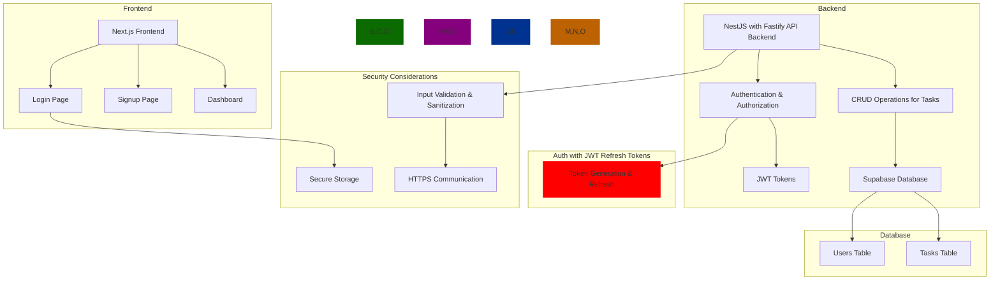

# Nestjs Nextjs Supabase starter template

This is an opiniated starter template for a NestJS application with Supabase as the database.

### _**-->Please read the links on the bottom of this readme first<--**_

- pnpm
- Nestjs API backend
- Fastify as the server
- Caching with Redis (KeyDB or Dragonfly as open source drop-in replacements)
- Rate limiting with Fastify rate limit
- Logging with Pino
- queue with BullMQ and/or Memphis.dev (Kafka alternative)
- Swagger for API documentation
- Drizzleorm as the ORM
- Supabase as the database
- Nextauth for authentication with Supabase RLS
- Nextjs frontend
- Tailwindcss for styling
- Shadcn for the UI components

## Todo

- [ ] migrate to monorepo
- [ ] add auth for backend and frontend (JWT with refresh tokens?)
- [ ] add rate limiting
- [ ] add caching
- [ ] add queue
- [ ] move shared types and utils to a shared package
- [ ] create a basic API user model
- [ ] create a basic dashboard layout as starting point
- [ ] create a simple todo app to demo functionality

## Demo model:

- users
- todos

## Inspiration & credits to

- [Rokas Dam](https://github.com/devRokas)
- [Rokas Dam nestjs starter - Nestjs + Supabase (no fastify, no drizzle, no auth)](https://github.com/devRokas/supabase-nestjs-rest-api-starter-kit)
- [Sakura Dev - video 1: Nestjs with Prisma and Nextauth](https://www.youtube.com/watch?v=khNwrFJ-Xqs)
- [Sakura Dev - Video 2: refactoring Nestjs with Drizzle](https://www.youtube.com/watch?v=l1DGXmmgZ9w)
- [NestJS](https://nestjs.com/)
- [Fastify](https://www.fastify.io/)
- [Pino](https://getpino.io/)
- [BullMQ](https://docs.bullmq.io/)
- [Memphis.dev](https://memphis.dev/)
- [KeyDB](https://keydb.dev/)
- [Dragonfly](https://dragonflydb.com/)
- [Supabase](https://supabase.io/)
- [Nextauth](https://next-auth.js.org/)
- [Nextjs](https://nextjs.org/)
- [Tailwindcss](https://tailwindcss.com/)
- [Shadcn](https://shadcn.com/)
- [Drizzleorm](https://drizzleorm.com/)
- [pnpm](https://pnpm.io/)

## Schema

